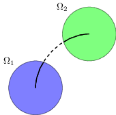
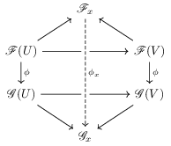
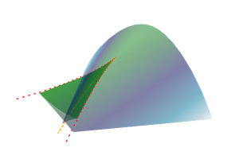

# Graphics

I like to make computer graphics, but I often need to tinker for a long time
in order to achieve the results I am after.
However, on-line forums tend to give very complicated examples that make
figuring out how they did the thing I want to do difficult, so I decided to
compile a series of simple examples myself.

Click on an image to get the corresponding (self-contained) source code.

## Ti*k*ZPicture

	
## Ti*k*Zcd

## Julia

## *matplotlib*
For best results, type `exec(open("filename.py").read())` within a Python REPL.

---

You can use [cURL](https://curl.se) to download these files!
Simply type `curl <link> --output <libname>` on your terminal of choice.
